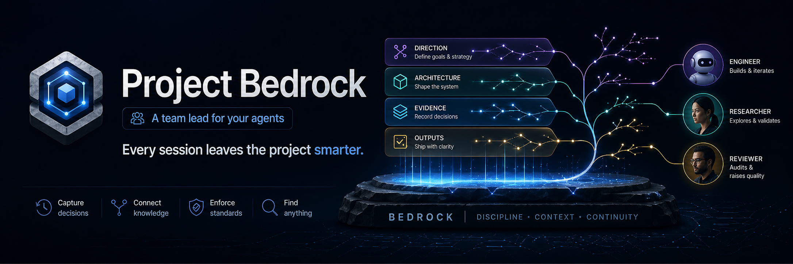

<div align="center">



# project-bedrock: A team lead for your AI agents.

### Every session starts with context.  
### Every important decision leaves a trail.  
### Every session leaves the project smarter.

robotaitai

[](https://pypi.org/project/project-bedrock/)
[](https://docs.anthropic.com/en/docs/claude-code)
[](https://cursor.sh) 
[](https://openai.com/codex) 
[](LICENSE) 


</div>

---

AI can write code fast.

What it does **not** do well by default is leave behind clear, shared project understanding.

Decisions disappear into chat history.  
Architecture gets rediscovered.  
New sessions start from zero.  
And the next developer, human or AI, has to figure out again what changed, where, and why.

**Project Bedrock** gives every repo a shared memory layer for humans and AI developers.

It works like the operating discipline of a strong team lead:
- every session starts with context
- every important change leaves a trail
- stable knowledge gets written down where the next developer can find it
- the project becomes easier to understand over time, not harder

With one command, your project gets:
- structured memory for architecture, decisions, conventions, and history
- project-local integration for **Claude Code** and **Cursor**
- lightweight git-friendly markdown that lives with the repo
- HTML, graph, and Obsidian-ready views of what the project knows

Under the hood, it is just markdown files and a CLI.  
No database. No server. No hosted backend. No black box.

**The result:** your AI developers stop behaving like disconnected sessions, and start behaving more like a team.

## 📦 Install

```bash
pip install project-bedrock
```

> **PyPI:** `project-bedrock` &nbsp;&middot;&nbsp; **CLI:** `bedrock` &nbsp;&middot;&nbsp; **alias:** `agent-knowledge` (deprecated)

---

## 🚀 Quick Start

```bash
cd your-project
bedrock init
```

**That's it.** Open the project in Claude Code or Cursor and the agent has persistent memory automatically -- no manual prompting, no config, no setup.

<details>
<summary><b>What <code>init</code> does in one shot</b></summary>

<br>

| Step | What happens |
|------|-------------|
| 1 | Creates `./agent-knowledge/` as a **real directory** inside the repo (git-tracked) |
| 2 | Registers the project in `~/agent-os/projects/<slug>/` so **every project shows up in one place** -- open it in Obsidian for a unified cross-project vault |
| 3 | Adds noisy subfolders (`Evidence/raw/`, `Outputs/site/`, ...) to `.gitignore` automatically |
| 4 | Installs project-local integration for **Claude Code** and **Cursor** |
| 5 | Detects **Codex** and installs its bridge files if present |
| 6 | Bootstraps the memory tree and marks onboarding as `pending` |
| 7 | Imports repo history into `Evidence/` and backfills lightweight history from git |

</details>

---

## 💾 Storage Modes

By default, knowledge lives **inside** the repo (git-tracked).
Curated knowledge is committed normally; noisy subfolders are gitignored.

```bash
# Default: in-repo (recommended)
bedrock init

# External: knowledge outside the repo (not committed)
bedrock init --external

# Convert external -> in-repo later
bedrock migrate-to-local
```

---

## 🧠 How It Works

Think of the vault as your team's **shared notebook**. Casual scribbles don't get mistaken for confirmed facts, and you can always tell what is canon vs. chatter.

### Knowledge Layers

| | Folder | What goes here | Canon? |
|---|--------|---------------|:------:|
| 📘 | **`Memory/`** | Decisions, conventions, architecture, gotchas -- what you'd tell a new hire | **Yes** |
| 📅 | **`History/`** | What happened and when -- releases, milestones, a dated trail | **Yes** |
| 📎 | `Evidence/` | Raw imports: docs, ADRs, PRs, screenshots -- captured context | No |
| 📊 | `Outputs/` | Generated views: HTML site, search index, knowledge map | No |

> **The rule:** only `Memory/` and `History/` are truth. Nothing imported, captured, or generated is ever treated as canon on its own. A developer has to consciously promote something into `Memory/` for it to count.

---

## 🔌 Project-Local Integration

The project carries **everything it needs**. Both Claude Code and Cursor get full integration installed automatically -- hooks, runtime contracts, and slash commands. No global config.

<details>
<summary><b>Claude Code</b> &nbsp;<code>.claude/</code></summary>

<br>

| File | Purpose |
|------|---------|
| `settings.json` | Lifecycle hooks: sync on SessionStart, Stop, PreCompact |
| `CLAUDE.md` | Runtime contract: knowledge layers, session protocol, onboarding |
| `commands/memory-update.md` | `/memory-update` slash command |
| `commands/system-update.md` | `/system-update` slash command |
| `commands/absorb.md` | `/absorb <file/folder>` slash command |

</details>

<details>
<summary><b>Cursor</b> &nbsp;<code>.cursor/</code></summary>

<br>

| File | Purpose |
|------|---------|
| `rules/agent-knowledge.mdc` | Always-on rule: loads memory context on every session |
| `hooks.json` | Lifecycle hooks: sync on start, update on write, sync on stop/compact |
| `commands/memory-update.md` | `/memory-update` slash command |
| `commands/system-update.md` | `/system-update` slash command |
| `commands/absorb.md` | `/absorb <file/folder>` slash command |

</details>

<details>
<summary><b>Codex</b> &nbsp;<code>.codex/</code> &nbsp;(installed when detected)</summary>

<br>

| File | Purpose |
|------|---------|
| `AGENTS.md` | Agent contract with knowledge layer instructions |

</details>

### ⚡ Session Lifecycle

Hooks fire automatically -- **zero manual intervention:**

| Event | Claude Code | Cursor | What runs |
|-------|:-----------:|:------:|-----------|
| Session start | `SessionStart` | `session-start` | `bedrock sync` |
| File saved | -- | `post-write` | `bedrock update` |
| Task complete | `Stop` | `stop` | `bedrock sync` |
| Context compaction | `PreCompact` | `preCompact` | `bedrock sync` |

The agent reads `STATUS.md` and `Memory/MEMORY.md` at the start of every session, with no prompting required.

### 💬 Slash Commands

These are how the team writes to the logbook. Both work in Claude Code and Cursor -- `init` installed them.

| Command | When to use it |
|---------|---------------|
| **`/memory-update`** | End of session, before logging off. The agent reviews what happened, writes stable facts into `Memory/`, and summarizes changes. **This is the team handoff** -- the next developer (or session) gets it for free. |
| **`/system-update`** | After upgrading `project-bedrock`. Refreshes hooks, rules, commands. Purely infrastructure -- never touches knowledge content. |

> A developer should never finish a session without running `/memory-update`. It's the equivalent of a daily standup writeup -- short, factual, and always there for the next person.

### 🩺 Integration Health

```bash
bedrock doctor
```

Reports whether all integration files are installed and current. If anything is stale or missing, `doctor` tells you exactly what to run.

---

## 🔮 Obsidian-Ready

Each project's `./agent-knowledge/` is a valid **Obsidian vault** on its own. But the real payoff is `~/agent-os/projects/`: every project you've ever run `init` in is registered there. Open that folder in Obsidian and you have **a unified vault across all your teams' projects** -- backlinks, graph view, and full-text search spanning every codebase you manage.

One window. Every team.

```bash
bedrock export-canvas
# produces: agent-knowledge/Outputs/knowledge-export.canvas
```

Obsidian is optional. Works without it too.

---

## 🛠️ Commands

| Command | What it does |
|---------|-------------|
| `init` | Set up a project -- one command, no arguments |
| `sync` | Full sync: memory, history, git evidence, index |
| `ship` | Validate + sync + commit + push |
| `view` | Build site and open in browser |
| `doctor` | Validate setup, integration health, note staleness |

<details>
<summary><b>All commands</b></summary>

<br>

`absorb` &middot; `search` &middot; `export-html` &middot; `export-canvas` &middot; `clean-import` &middot; `refresh-system` &middot; `backfill-history` &middot; `compact` &middot; `migrate-to-local` &middot; `init --external`

All write commands support `--dry-run` and `--json`. Run `bedrock --help` for the full list.

</details>

## More

- [Static site export](docs/reference.md#static-site-export) -- `bedrock view` builds an interactive HTML site from your vault
- [Automatic capture](docs/reference.md#automatic-capture) -- every sync event is recorded as lightweight evidence
- [Progressive retrieval](docs/reference.md#progressive-retrieval) -- agents load only the branches they need
- [Clean web import](docs/reference.md#clean-web-import) -- import a URL as cleaned markdown evidence
- [Project history](docs/reference.md#project-history) -- lightweight event log auto-backfilled from git
- [Keeping up to date](docs/reference.md#keeping-up-to-date) -- `pip install -U project-bedrock` + `bedrock refresh-system`
- [Custom knowledge home](docs/reference.md#custom-knowledge-home) -- change where `~/agent-os/` lives
- [Troubleshooting](docs/reference.md#troubleshooting) -- common issues and fixes
- [Platform support](docs/reference.md#platform-support) -- macOS, Linux, Python 3.9+
- [Development](docs/reference.md#development) -- contributing and running tests

## Star History

[](https://star-history.com/#robotaitai/agent-knowledge&Date)
