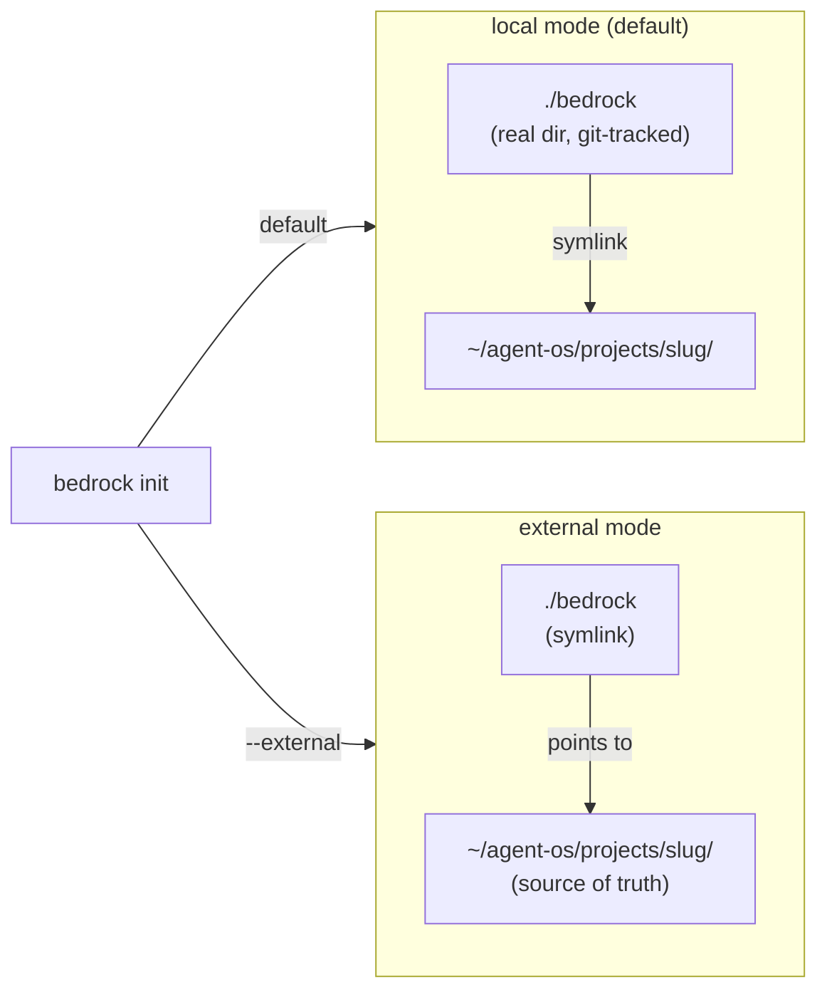
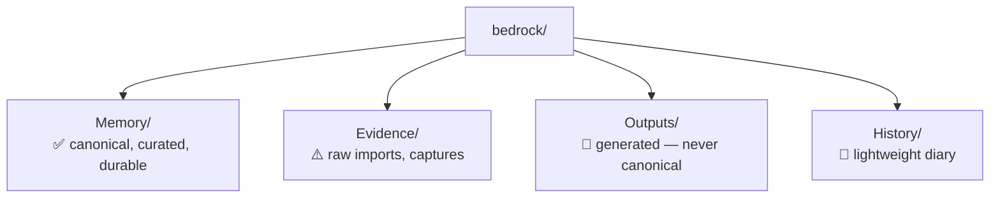
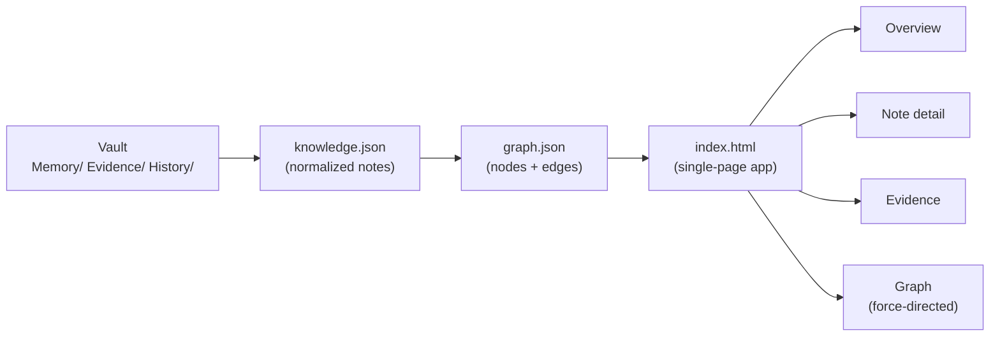

# 🏗️ Architecture

Core design: path resolution, runtime modules, project config, integrations, knowledge vault model.

## ⚙️ Runtime Modules (`src/agent_knowledge/runtime/`)

| Module | Purpose |
|--------|---------|
| `paths.py` | Asset directory resolution (installed vs dev checkout) |
| `shell.py` | `run_bash_script()` / `run_python_script()` subprocess wrappers |
| `integrations.py` | Multi-tool detection and bridge file installation |
| `sync.py` | `bedrock sync` implementation (memory, sessions, git, capture, index) |
| `capture.py` | Automatic capture layer (Evidence/captures/ YAML files) + clean-import |
| `index.py` | Knowledge index generation (knowledge-index.json/md) + search |
| `site.py` | Static HTML site export with interactive graph view |
| `refresh.py` | System refresh: updates integration files to current framework version |
| `history.py` | Lightweight history layer (History/events.ndjson, history.md, timeline/) |

## 🗄️ Knowledge Vault Model

Two storage modes controlled by `vault_mode` in `.agent-project.yaml`:

`bedrock init` defaults to local mode. Use `--external` for external mode, or `bedrock migrate-to-local` to convert an existing external project.
In local mode, `.gitignore` auto-patched to exclude `Evidence/raw/`, `Sessions/`, `Outputs/site/`, etc.

Vault structure (same in both modes):

## 📂 Path Resolution

- `runtime/paths.py` → `get_assets_dir()` with dual-mode:
  1. Installed: `assets/` sibling of `runtime/` in site-packages
  2. Dev: `repo_root/assets/` (4 parents up from `paths.py`)
- Marker file for validation: `scripts/lib/knowledge-common.sh`
- Result cached in `_cached_assets_dir` for the process lifetime

## 🗂️ Asset Layout

All non-Python assets under `assets/`:
- `assets/scripts/` — bundled bash scripts
- `assets/templates/` — project, memory, integrations, portfolio templates
- `assets/rules/` — project-level Cursor rules
- `assets/rules-global/` — global Cursor rules
- `assets/commands/` — agent command docs (system-update, ship, etc.)
- `assets/skills/` — composable skill files for agent use
- `assets/skills-cursor/` — Cursor-specific skills
- `assets/claude/` — Claude Code integration files

## 🌐 Site Generation Pipeline

Wikilink edges: `build_graph_data()` extracts `[[wikilinks]]` from each note's rendered HTML and adds blue `related_to` edges between nodes, giving the graph semantic cross-connections beyond the folder hierarchy.

`_md_to_html()` supports: headings (with inline wikilinks), paragraphs, bullet/ordered lists, blockquotes, fenced code blocks, horizontal rules, and `|pipe|` markdown tables rendered as `<table>` elements.

## 📅 History Layer

- `History/events.ndjson` — append-only machine-readable log
- `History/history.md` — human-readable entrypoint (< 150 lines)
- `History/timeline/` — sparse milestone notes (init, backfill, releases only)
- Dedup: releases once-per-tag, backfill once-per-month, project_start once-ever
- Auto-created by `init`, refreshable with `backfill-history`

## ⚙️ Project Config (`.agent-project.yaml`)

- Version 4, `ontology_model: 2`, `framework_version` field
- `knowledge.vault_mode: local|external` — set by `init --local` or `migrate-to-local`
- `onboarding: status: pending|complete` in STATUS.md
- No `root_index` — entry points are STATUS.md + Memory/MEMORY.md
- Hooks reference `bedrock update --project .`

## 🔁 System Refresh (`runtime/refresh.py`)

- Compares `framework_version` in STATUS.md to `__version__`
- Refreshes: `AGENTS.md`, `.cursor/hooks.json`, `.cursor/rules/agent-knowledge.mdc`, `CLAUDE.md`, `.codex/AGENTS.md`, `STATUS.md`, `.agent-project.yaml`
- Idempotent: skips files already at current version
- `is_stale()` used by `doctor` command for staleness warning

## 📸 Capture Layer

- `Evidence/captures/` — YAML event files (timestamp, source_tool, event_type, touched_branches)
- Idempotent within same UTC minute
- Sources: sync, init, refresh, graph sync, import, ship

## 🔍 Knowledge Index

- `Outputs/knowledge-index.json` — structured catalog for programmatic retrieval
- `Outputs/knowledge-index.md` — human-readable version
- Search: Memory-first, Evidence/Outputs clearly marked non-canonical
- Used by `bedrock search <query>`

## ⚠️ Gotchas

- `set -euo pipefail` + trailing `[` test returning false causes exit 1 — fixed with explicit `if`
- `ship.sh` must use `python -m pytest -q` not bare `pytest`
- Canvas 2D rendering: reading `clientWidth`/`clientHeight` after `display:none→block` must be deferred with `requestAnimationFrame` (graph fix, 2026-04-11)
- Evidence/Outputs are non-canonical and must not be auto-promoted to Memory/

## 🕓 Recent Changes

- 2026-04-28: Local vault mode is now the default (`init` no longer needs `--local`; use `--external` to opt out).
- 2026-04-28: `site.py` table rendering fixed — markdown tables now render as proper HTML `<table>` elements.
- 2026-04-28: Graph wikilink edges added — `build_graph_data()` extracts `[[wikilinks]]` and creates blue `related_to` edges.
- 2026-04-28: Graph node selection dims unrelated nodes and keeps neighbors semi-visible with labels.
- 2026-04-28: Graph layout spread tuned — `SIM_REPULSION 18000`, `SIM_REST 220`, `SIM_GRAVITY 0.008` for a readable layout.
- 2026-04-28: Staleness detection added to `doctor` via `check_stale_notes()` in `refresh.py`.

## 🔗 See Also

- [[stack]] — languages, runtimes, and dependencies
- [[conventions]] — coding and design conventions
- [[packaging]] — how the package is built and distributed
