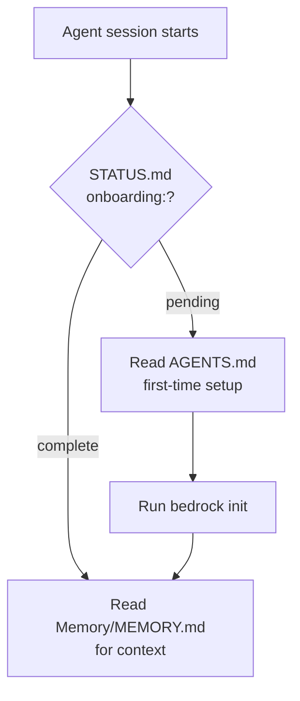

# Integrations

Multi-tool detection and bridge file installation for Cursor, Claude, and Codex.

## Detection (`runtime/integrations.py`)

| Tool | Detection | Always installed? |
|------|-----------|-------------------|
| Cursor | `.cursor/` exists | Yes (default integration) |
| Claude | `.claude/` exists | Only if detected |
| Codex | `.codex/` exists | Only if detected |

Called by [[cli#init (zero-arg)|init]] via `detect()` then `install_all()`.

**As of 0.2.5**: Cursor and Claude are both first-class. Detection table updated:

| Tool | Detection | Always installed? |
|------|-----------|-------------------|
| Cursor | `.cursor/` exists | Yes |
| Claude | `.claude/` exists OR `CLAUDE.md` exists | Yes (always, like Cursor) |
| Codex | `.codex/` exists | Only if detected |

## Bridge Files

### Cursor (first-class)
- `.cursor/hooks.json` -- **4 hooks**: `post-write` (update), `session-start` (sync), `stop` (sync), `preCompact` (sync)
- `.cursor/rules/bedrock.mdc` -- `alwaysApply` rule: knowledge layers table, onboarding flow, `/memory-update` reference (was `agent-knowledge.mdc`; auto-renamed by `refresh-system`)
- `.cursor/commands/memory-update.md` -- `/memory-update` slash command
- `.cursor/commands/system-update.md` -- `/system-update` slash command

Rule content is **inlined as `_CURSOR_RULE` in `integrations.py`** AND available as `assets/templates/integrations/cursor/bedrock.mdc`. `refresh.py` uses the template file if present, falls back to the constant.

Constants in `integrations.py`:
- `CURSOR_EXPECTED_HOOK_EVENTS = {"session-start", "post-write", "stop", "preCompact"}`
- `CURSOR_EXPECTED_COMMANDS = {"memory-update.md", "system-update.md"}`

`check_cursor_integration(repo_root)` in `refresh.py` validates all 3 components and is called by `doctor`.

### Claude Code (first-class, added 0.2.5)
- `.claude/settings.json` -- hooks: SessionStart (sync), Stop (sync), PreCompact (sync)
- `.claude/CLAUDE.md` -- runtime contract: knowledge layers, onboarding flow, `/memory-update` reference
- `.claude/commands/memory-update.md` -- `/memory-update` slash command
- `.claude/commands/system-update.md` -- `/system-update` slash command

`check_claude_integration(repo_root)` in `refresh.py` mirrors Cursor's health check. Called by `doctor`.

### Codex
- `.codex/AGENTS.md` -- directs to root `AGENTS.md` and [[STATUS]]

## Onboarding Handoff

No manual `next-prompt` command needed.

## PATH Conflict Gotcha

Multiple tools can install an `agent-knowledge` binary. Graphify (Node.js) installs one at `~/.nvm/versions/node/<version>/bin/agent-knowledge` which may shadow our Python CLI. Fix: add Python bin to PATH before nvm — `export PATH="/Users/taio/Library/Python/3.13/bin:$PATH"`. Or invoke directly: `python3 -m agent_knowledge`.

## Key Decision

Cursor rule content is **inlined as `_CURSOR_RULE`** in `integrations.py` AND stored at `assets/templates/integrations/cursor/bedrock.mdc`. `refresh.py` prefers the file; falls back to the constant. See [[decisions]].

## Recent Changes

- 2026-04-29: Cursor rule renamed `agent-knowledge.mdc` → `bedrock.mdc`. `refresh-system` auto-migrates existing installs. All bridge file path references updated to `./bedrock/`. `repo_abs` now uses `.as_posix()` to generate forward-slash paths (Windows JSON fix).

## See Also

- [[cli#init (zero-arg)|init command]] -- orchestrates detection and install
- [[architecture#Integration System]] -- design overview
- [[testing]] -- integration test coverage
