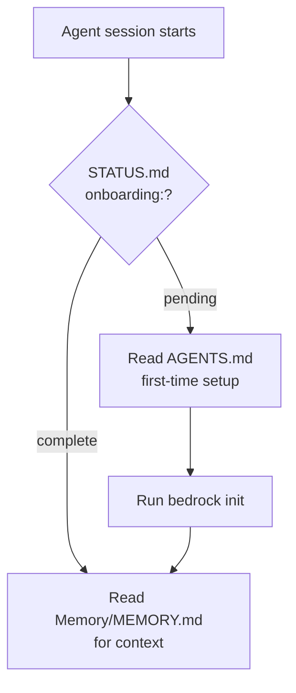

# 🔌 Integrations

Multi-tool detection and bridge file installation for Cursor, Claude, Codex, Gemini CLI, and Antigravity.

## 🔍 Detection (`runtime/integrations.py`)

| Tool | Detection | Always installed? |
|------|-----------|-------------------|
| Cursor | `.cursor/` exists | Yes |
| Claude | `.claude/` exists OR `CLAUDE.md` exists | Yes |
| Codex | `.codex/` exists | Only if detected |
| Gemini CLI / Antigravity | `.gemini/` exists OR `GEMINI.md` exists | Only if detected |

Called by [[cli#init|init]] via `detect()` then `install_all()`.

## 🌉 Bridge Files

### Cursor (first-class)
- `.cursor/hooks.json` -- 4 hooks: `post-write`, `session-start`, `stop`, `preCompact`
- `.cursor/rules/bedrock.mdc` -- `alwaysApply` rule (was `agent-knowledge.mdc`; auto-renamed by `refresh-system`)
- `.cursor/commands/memory-update.md`, `system-update.md`, `absorb.md`, `compact-context.md`

### Claude Code (first-class)
- `.claude/settings.json` -- hooks: SessionStart, Stop, PreCompact
- `.claude/CLAUDE.md` -- runtime contract
- `.claude/commands/memory-update.md`, `system-update.md`, `absorb.md`, `compact-context.md`

### Codex
- `.codex/AGENTS.md` -- fully self-contained (v0.4.5+): includes onboarding, memory-update procedure, compact-context, knowledge structure. No longer defers to root AGENTS.md.

### Gemini CLI / Antigravity (v0.4.7+)
- `GEMINI.md` at project root — memory contract for Gemini CLI and Antigravity IDE
- Both tools share `~/.gemini/GEMINI.md` as global config (`install-global` writes there)
- Antigravity also reads `AGENTS.md` (already covered by root AGENTS.md)

## 🌐 Global Install (`bedrock install-global`)

New in v0.4.6. Writes conditional rules to user-global config dirs so bedrock activates in any project with a `./bedrock/` vault — no per-project setup needed.

| Target | Tool |
|--------|------|
| `~/.cursor/rules/bedrock-global.mdc` | Cursor |
| `~/.claude/CLAUDE.md` (appended) | Claude Code |
| `~/.codex/AGENTS.md` (appended) | Codex |
| `~/.gemini/GEMINI.md` (appended) | Gemini CLI + Antigravity |

All writes are sentinel-guarded (idempotent). `--uninstall` removes them. `--dry-run` previews.

## 🤝 Onboarding Handoff

No manual `next-prompt` command needed.

## 🪟 Windows Support (v0.4.0+)

Windows is fully supported as of v0.4.0:
- `shell.py`: auto-detects Git Bash (`git-for-Windows`) on PATH and known install paths
- `integrations.py`, `refresh.py`: forward-slash paths in all generated JSON (backslash fix)
- `sync.py`, `history.py`, `refresh.py`: `encoding="utf-8"` on all git subprocess calls
- `bootstrap-memory-tree.sh`: symlink check skipped on Windows / local vault mode

Not in CI matrix (ubuntu + macos only), but core functionality is covered by these targeted fixes.

## ⚠️ PATH Conflict Gotcha

Multiple tools can install an `agent-knowledge` binary. Graphify (Node.js) installs one at `~/.nvm/versions/node/<version>/bin/agent-knowledge` which may shadow our Python CLI. Fix: add Python bin to PATH before nvm — `export PATH="/Users/taio/Library/Python/3.13/bin:$PATH"`. Or invoke directly: `python3 -m agent_knowledge`.

## 📌 Key Decision

Cursor rule content is **inlined as `_CURSOR_RULE`** in `integrations.py` AND stored at `assets/templates/integrations/cursor/bedrock.mdc`. `refresh.py` prefers the file; falls back to the constant. See [[decisions]].

## 🕓 Recent Changes

- 2026-04-29: Cursor rule renamed `agent-knowledge.mdc` → `bedrock.mdc`. `refresh-system` auto-migrates existing installs. All bridge file path references updated to `./bedrock/`. `repo_abs` now uses `.as_posix()` to generate forward-slash paths (Windows JSON fix).
- 2026-05-05: v0.4.5 — `.codex/AGENTS.md` rewritten to be fully self-contained; removed dependency on root AGENTS.md.
- 2026-05-05: v0.4.6 — `install-global` command added; installs conditional rules in `~/.cursor/`, `~/.claude/`, `~/.codex/`.
- 2026-05-05: v0.4.7 — Gemini CLI + Antigravity added; `GEMINI.md` template; detection via `.gemini/` or `GEMINI.md`; `install-global` writes `~/.gemini/GEMINI.md`.

## 🔗 See Also

- [[cli#init (zero-arg)|init command]] -- orchestrates detection and install
- [[architecture#Integration System]] -- design overview
- [[testing]] -- integration test coverage
